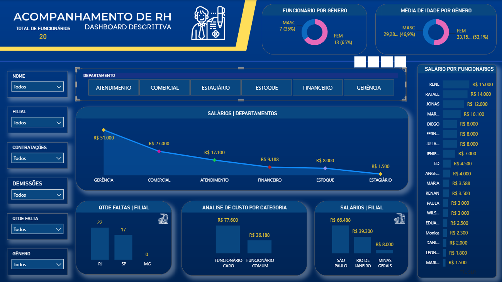
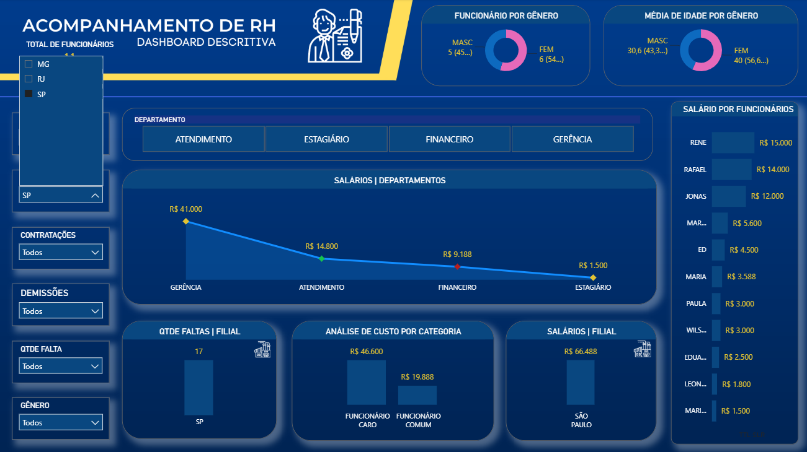

# Acompanhamento de RH — Dashboard Power BI

Dashboard descritivo de indicadores de Recursos Humanos: quadro de funcionários, distribuição por gênero e idade, faltas, custos e salários por departamento e filial.

## 🎯 Objetivo
Centralizar indicadores de RH (headcount, absenteísmo, custo de folha) para apoiar decisões de gestão de pessoas.

## 📊 Fonte de dados
Dados fictícios, simulando uma empresa com múltiplas filiais e departamentos.

## 🛠️ Ferramentas
Power BI Desktop · DAX · Power Query

## 🖼️ Preview



## 💡 Principais insights
- Quadro de 20 funcionários, com maioria feminina (65% x 35%)
- Idade média similar entre os gêneros: 29,3 anos (masc) e 33,2 anos (fem)
- Forte concentração salarial na Gerência (R$ 51.000) frente aos demais departamentos, caindo até R$ 1.500 para Estagiário
- Absenteísmo maior na filial do Rio de Janeiro (22 faltas) do que São Paulo (17) e Minas Gerais (0)
- "Funcionários caros" custam mais que o dobro dos "comuns" (R$ 77.600 vs R$ 36.188)
- São Paulo concentra a maior folha salarial (R$ 66.488) entre as três filiais

## 📁 Estrutura
```
- Projeto Acompamhamento RH.pbix
- imagens/
- README.md
```
## 📬 Contato
[GitHub](https://github.com/RPessotti) · [LinkedIn](https://linkedin.com/in/rafael-pessotti-563240323)
