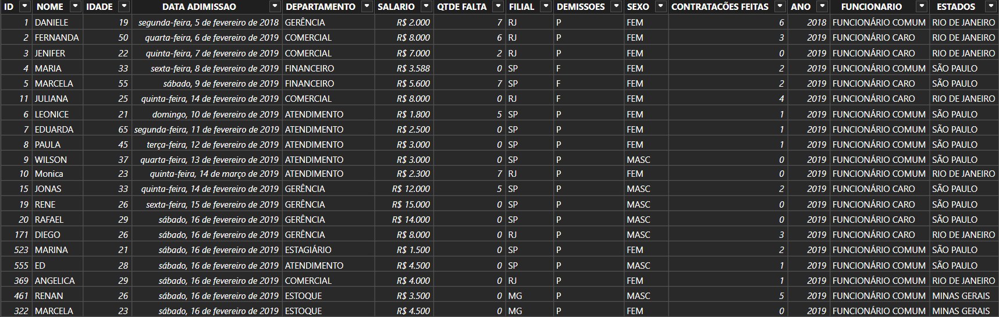

<h1 align="center">HR Management Dashboard</h1>

<p align="center">
  <strong>Dashboard de gestão em Power BI</strong> — acompanhamento de indicadores de Recursos Humanos: headcount, absenteísmo e custo de folha
</p>

<p align="center">
  
  
  
</p>

---
## 🎯 Objetivo
Centralizar indicadores de RH — headcount, absenteísmo, distribuição por gênero/idade e custo de folha — por departamento e filial, para apoiar decisões de gestão de pessoas.

## 📊 Fonte de dados
Dados fictícios da plataforma Kaggle, simulando uma empresa com múltiplas filiais (São Paulo, Rio de Janeiro e Minas Gerais) e departamentos.

## 🛠️ Ferramentas utilizadas
Power BI Desktop · DAX · Power Query (M)

## 🖼️ Preview
### Visão Geral
<p align="center">
  <br>
<em>Painel geral com os 20 funcionários da base: distribuição por gênero e idade, salários por departamento e por filial, faltas e análise de custo por categoria de funcionário.</em>
</p>

### Filtro por Filial 
<p align="center">
  <br>
<em>Mesmo painel filtrado pela filial de São Paulo, mostrando como os indicadores de gênero, idade e custo se comportam de forma independente para cada unidade.</em>
</p>

### Fonte de Dados
<p align="center">
  <br>
<em>Base de dados utilizada, com colunas de nome, idade, data de admissão, departamento, salário, faltas, filial, demissões, sexo e contratações.</em>
</p>

### Estrutura de Colunas (tb_rh)
<p align="center">
  <br>
<em>Colunas da tabela tb_rh utilizadas na modelagem do relatório.</em>
</p>

## 🔗 Dashboard Interativo
[▶️ Dashboard público](https://app.powerbi.com/view?r=eyJrIjoiYTgzOTIwMjUtZWI2Zi00OWViLWJlZmEtOGYwM2Y0OTAxMTlkIiwidCI6IjY1NWFhNjFkLTVkY2ItNDE4Mi05N2YxLTJmNTQ5MTlkZTBjZiJ9)

## 💡 Principais insights
- Base de 20 funcionários, com 65% mulheres (13) e 35% homens (7)
- Idade média de 33,2 anos entre as mulheres e 29,3 anos entre os homens
- Gerência concentra o maior custo salarial (R$ 51 mil), enquanto Estagiário tem o menor (R$ 1,5 mil)
- Funcionários classificados como "caro" custam mais que o dobro dos "comum" em folha (R$ 77,6 mil vs R$ 36,2 mil)
- São Paulo lidera o custo de folha entre as filiais (R$ 66,5 mil), seguida por Rio de Janeiro (R$ 39,3 mil) e Minas Gerais (R$ 8 mil)
- Rio de Janeiro registra o maior número de faltas (22), contra 17 em São Paulo e nenhuma em Minas Gerais

## 📁 Estrutura
- Projeto Acompanhamento RH.pbix
- imagens/
- README.md

## 📬 Contato
[GitHub](https://github.com/RPessotti) · [LinkedIn](https://linkedin.com/in/rafael-pessotti-563240323)
```
- Projeto Acompamhamento RH.pbix
- objetivo
- fonte de dados
- ferramentas utilizadas
- imagens
- dashboard pública
- README.md
```
## 📬 Contato
[GitHub](https://github.com/RPessotti) · [LinkedIn](https://linkedin.com/in/rafael-pessotti-563240323)
